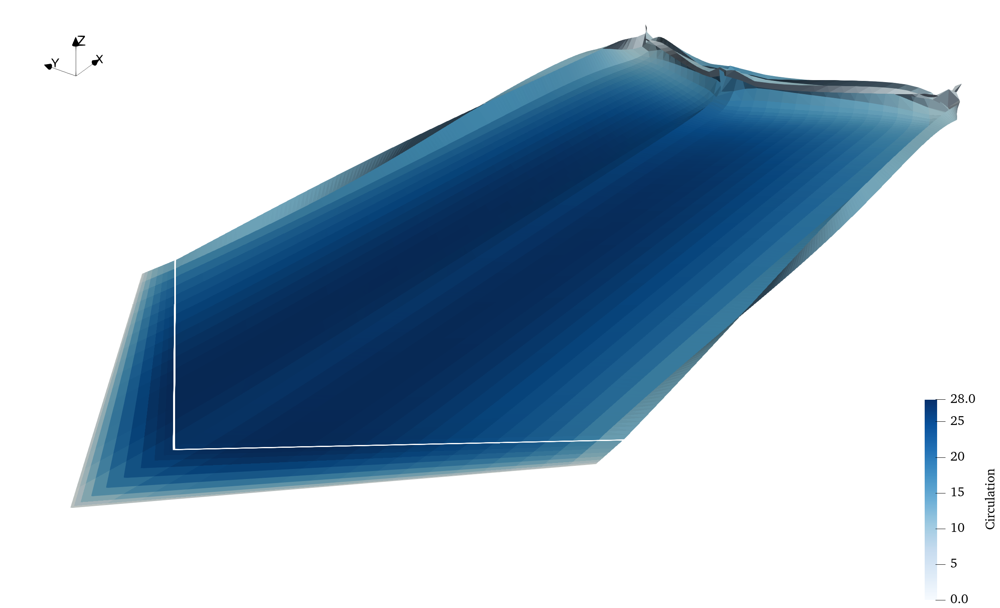

title: Tutorial 2: Swept wing from NASA Technical Report 1208

For this tutorial we'll create a geometry using [OpenVSP](https://openvsp.org/) and use that to validate a tapered swept wing test case from NASA TR-1208.

### Geometry details
The dimensions of the wing are provided in the table below.

| Parameter | Value | Unit |
| --- | --- | --- |
| span | 127.26 | in |
| root chord | 21.94 | in |
| tip chord | 9.87 | in |
| mean aerod. chord | 16.67 | in |
| sweep | 45 | deg |
| airfoil | NACA 63A012 | |

Once the wing is created in OpenVSP, save it as a DegenGeom matlab file using Analysis > DegenGeom. This saves a matlab script that contains the camber geometry which VOLCANOR requires. The matlab script can then be converted to a Plot3D mesh file using the helper script `degen2plot3d.m` in the `tools` folder in the VOLCANOR repo. This Plot3D file can be provided to VOLCANOR through the `geometryFile` field in the `geomXX.nml` input file.
```Matlab
% This writes out a Plot3D file with the extension .xyz
> degen2plot3d("TR1208_DegenGeom.m");
% Creates TR1208_DegenGeom.xyz
```
Once the PLOT3D file is created, we can move on to setting up the case in VOLCANOR. The PLOT3D file was renamed to `TR1208.xyz` for ease of use. Note that the number of panels in the chordwise and spanwise directions used while creating the geometry in OpenVSP cannot be changed.

### Case directory setup
Use the `newcase.sh` script to generate a new 'case' directory with the name `simplewing.case` as described in [Case directory setup](index.html).

### Case setup
The `config.nml` file sets up global parameters that control the whole simulation like number of timesteps, timestep length and fluid density. For this case, the default settings should work fine. The relevant section is shown below and the number of timesteps `nt` is set to be computed from the time required for the wing to traverse 20 chord lengths. The timestep length `dt` defaults to time taken for traversing a distance 1/16th of the chord length. Intervals at which solution plots and results should be written out may be controlled in sections below the `PARAMS` section.

```Fortran
&PARAMS
! NO. OF TIMESTEPS [nt]    TIMESTEP (sec) [dt]         NO. OF ROTORS [nr]
! [nt]timesteps  [0]default  [-nt]chords or revs
nt = -20
dt = 0.0
nr = 1
! DENSITY [kg/m3]    SOUND VEL. [m/s]  KINEMATICVISC [m2/s]
density = 1.0
velSound = 330.0
kinematicVisc = 0.000018
/
```

Geometry required for each simulation is defined using the `geomXX.nml` files, where `XX` denotes a serial number. For the `geom01.nml` file, the relevant section is shown below. The parameter `theta0` represent the wing pitch angle and the nomenclature is borrowed from rotorcraft conventions. The freestream velocity is set to an arbitrary 300 in/s using the vector `velBody`. Note the axis conventions used here. The negative sign is present since we are setting the velocity of the geometry which is towards the negative direction in an inertial coordinate frame. The chord is set to the mean aerodynamic chord in inches.

```Fortran
&GEOMPARAMS
! Span[m]      root_cut[r/R]      chord[m]    preconeAngle[deg]
span = 127.26
rootcut = 0.0
chord = 16.672
preconeAngle = 0.0
! Omega[rad/s]   X-shaftAxis     Y-shaftAxis     Z-shaftAxis
Omega = 0.0
shaftAxis = 0.0, 0.0, 1.0
! theta0[deg]    thetaC[deg]    thetaS[deg]    thetaTwist[deg]
theta0 = 4.7
thetaC = 0.0
thetaS = 0.0
thetaTwist = 0.0
! axisymmetrySwitch  [0]Off [1]On
axisymmetrySwitch = 0
! pivot point     flapHinge      spanwiseLiftTerm    invert tauSpan
! from LE[x/c]  from centre[r/R]    [1]enable     for swept/symmetric
pivotLE = 0.00
flapHinge = 0.0
spanwiseLiftSwitch = 0
symmetricTau = 1
! customTrajectorySwitch  [0]Off [1]On
customTrajectorySwitch = 0
! u[m/s]    v[m/s]     w[m/s]    p[rad/s]    q[rad/s]    r[rad/s]
velBody = -300.0, 0.0, 0.0
omegaBody = 0.0, 0.0, 0.0
! forceCalcSwitch
! [0]gamma [1]alpha [2]FELS             No. of airfoil files
forceCalcSwitch = 0
nAirfoils = 0
/
```

The wing and wake discretization may be set in the `PANELS` section. Providing a large number of near wake rows using `nNwake` ensures that the wake surface is modelled with sufficient accuracy. `nc` and `ns` control the number of chordwise and spanwise panels on the wing. Ensure that `nc` and `ns` are one less than the number of points provided in the PLOT3D file header.
```Fortran
&PANELS
! No. of blades,nb  Prop convention [0]Helicopter [1]Prop
nb = 1
propConvention = 0
! Panel discretization [1]linear [2]cosine [3]halfsine [4]tan
spanSpacing = 2
chordSpacing = 1
! degengeom geometryFile from OpenVSP
geometryFile = 0
nCamberFiles = 0
! Chordwise panels,nc   Spanwise panels,ns
nc = 10
ns = 34
! Near wake panels,nNwake [n]timesteps [-n]chords/revs
nNwake = 350
/
```

### Simulation
To run the simulation we make use of the `Makefile` present in this case folder. Start the simulation using the `make` command. When the simulation is run, the current timestep is printed out on screen and a copy of the output is also written to `volcanor.log`.

During the simulation, basic monitors like force plots can be generated using the script provided in `tools/plotit.py`. For example, to monitor the force coefficient, use the `-f` flag.
```bash
./tools/plotit.py -f
```
We can plot the wakes during or after the simulation completes. [Paraview](https://www.paraview.org/) is a powerful data visualization software that is recommended to postprocess results. Alternatives like [Tecplot](https://www.tecplot.com/) or [VisIt](https://visit-dav.github.io/visit-website/index.html) can also be used. Visualize the wake by opening the `r01wingNwakeXXXXX.tec` tecplot files generated by the solver in the `Results` directory.  

Such a visualization using Paraview is shown below.


A basic validation example is shown below from the reference provided in the [Documentation](../index.html) page.

|        | Experiment | VOLCANOR | Error %|
| ---    | --- | --- | --- |
| Lift at \(2.0^\circ\) | 0.142 | 0.125 | 3.7 % |
| Lift at \(4.7^\circ\) | 0.312 | 0.292 | 6.4 % |
| Lift at \(8.0^\circ\) | 0.500 | 0.491 | 1.8 % |


